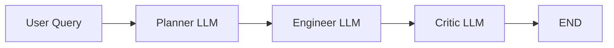
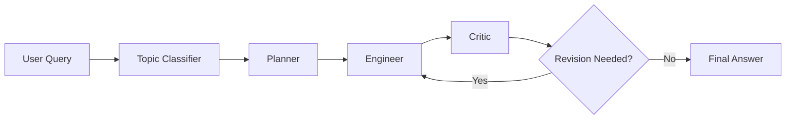

# Multi-Agent with LangGraph

A small experimental project that explores how a **multi-agent LLM workflow** can be used to analyze HTML/CSS problems and provide suggestions for code correction and web accessibility issues.

The workflow is built with **LangGraph** and organizes LLM calls into three sequential roles:

**Planner → Engineer → Critic**

The notebook includes example prompts related to malformed HTML, CSS styling, color-contrast accessibility, and heading hierarchy.

---

## Overview

The project demonstrates a simple state-based multi-agent architecture in which a user query is passed through multiple LLM roles.

- **Planner** — produces a plan for the submitted problem.
- **Engineer** — responds as an HTML/CSS expert and proposes a solution.
- **Critic** — provides additional feedback intended to improve the proposed solution.
- **LangGraph** — manages the execution flow and shared message state.

The current compiled graph follows this sequence:



---

## Features

- Multi-agent workflow using LangGraph
- Shared graph state with `TypedDict`
- Planner, Engineer, and Critic LLM roles
- HTML and CSS problem analysis
- Accessibility-oriented examples
- Graph visualization with Mermaid
- Structured topic-selection experiment using Pydantic
- OpenAI model integration through `langchain-openai`

---

## Example Problems

The notebook contains test cases such as:

### HTML Carousel Control

```html
<button
    class="carousel-control-prev"
    type="button"
    data-bs-target="#carouselExample"
    data-bs-slide="Previous slider"
    alt="Previous slider">
</button>
```

The agents are used to analyze issues such as incorrect attribute usage and carousel-control configuration.

### CSS / Text Color

```html
<span style="color:#58E7E7;">
```

This example is used in the context of CSS and readability-related problems.

### Heading Hierarchy

```html
<h4 class="heading">
```

The workflow also evaluates accessibility problems involving non-sequential heading levels.

### Color Contrast Accessibility

The notebook includes a prompt related to the accessibility warning:

> Background and foreground colors do not have sufficient contrast ratio.

The agents generate planning and correction suggestions for this type of issue.

---

## Project Structure

```text
.
└── Example_project_noexecute.ipynb
```

The current repository is notebook-based and contains the complete experimental workflow in a single Jupyter Notebook.

---

## Technologies

- Python
- LangGraph
- LangChain
- OpenAI API
- Pydantic
- python-dotenv
- Jupyter / IPython
- CrewAI

> **Note:** `CrewAI` is imported in the notebook, but the active multi-agent workflow is implemented with LangGraph.

---

## Installation

Clone the repository and install the required packages:

```bash
git clone <your-repository-url>
cd <your-repository-name>

pip install langgraph langchain langchain-openai python-dotenv pydantic crewai ipython
```

Using a virtual environment is recommended.

---

## Environment Variables

Create a `.env` file in the project directory and add your OpenAI API key:

```env
OPENAI_API_KEY=your_openai_api_key
```

Do not commit your `.env` file or API key to GitHub.

---

## Running the Project

Start Jupyter Notebook or JupyterLab:

```bash
jupyter notebook
```

Then open:

```text
Example_project_noexecute.ipynb
```

Run the cells in order to initialize the language model, define the graph state, create the agent functions, compile the LangGraph workflow, and execute the example inputs.

The notebook configures the model as:

```python
llm = ChatOpenAI(
    temperature=0,
    model="gpt-3.5-turbo-16k"
)
```

If you run the project in a different environment, update the model configuration as needed.

---

## Core Graph Definition

The active graph contains three nodes:

```python
graph.add_node("Engineer_LLM", function_2)
graph.add_node("Critic_LLM", function_3)
graph.add_node("Planner_LLM", function_4)

graph.set_entry_point("Planner_LLM")

graph.add_edge("Planner_LLM", "Engineer_LLM")
graph.add_edge("Engineer_LLM", "Critic_LLM")
graph.add_edge("Critic_LLM", END)
```

The graph is then compiled with:

```python
app = graph.compile()
```

A visualization of the workflow can also be generated with:

```python
display(Image(app.get_graph().draw_mermaid_png()))
```

---

## Experimental Components

The notebook also contains a structured topic-selection component based on `PydanticOutputParser`.

Its intended output is restricted to:

```text
HTML
CSS
```

A separate `router()` function is also defined.

In the current notebook, however, the topic-selection function and router are **not connected to the compiled LangGraph workflow**. The active graph runs directly through Planner, Engineer, and Critic.

---

## Current Implementation Note

Although the execution order is:

```text
Planner → Engineer → Critic
```

the current `Engineer` and `Critic` functions both access:

```python
question = messages[0]
```

Therefore, they primarily operate on the **original user query**.

In particular, the Critic is not explicitly given the Engineer's generated answer as the text to review.

A future version can make the collaboration more genuinely agent-to-agent by passing the latest generated response to the next role.

For example, the Critic could inspect the Engineer output from the shared state before producing its feedback.

---

## Possible Improvements

Future development could include:

- Connecting the HTML/CSS topic selector to the main graph
- Activating conditional routing
- Passing Planner output to the Engineer
- Passing Engineer output directly to the Critic
- Adding a revision loop from Critic back to Engineer
- Returning a single final corrected code block
- Adding automatic HTML/CSS validation
- Integrating accessibility checks
- Supporting additional frontend technologies
- Moving agent prompts into separate configuration files
- Adding unit tests and evaluation examples

A more advanced workflow could follow:



---

## Purpose

This project is primarily an experimental implementation for exploring:

- LLM-based software assistance
- Multi-agent collaboration
- State-based LLM orchestration
- Automated HTML/CSS debugging
- Web accessibility support

It can serve as a starting point for a more complete AI-assisted frontend code review or accessibility analysis system.

---

## Disclaimer

This is an experimental project. LLM-generated code suggestions should be reviewed and tested before being used in production environments.
